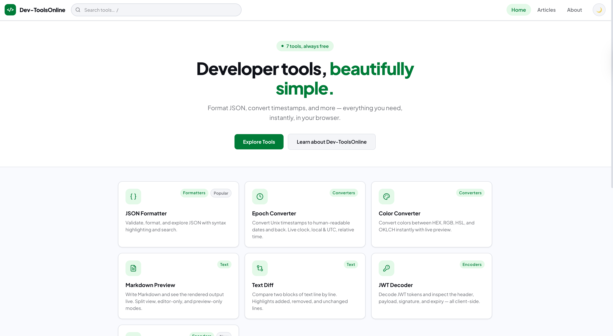
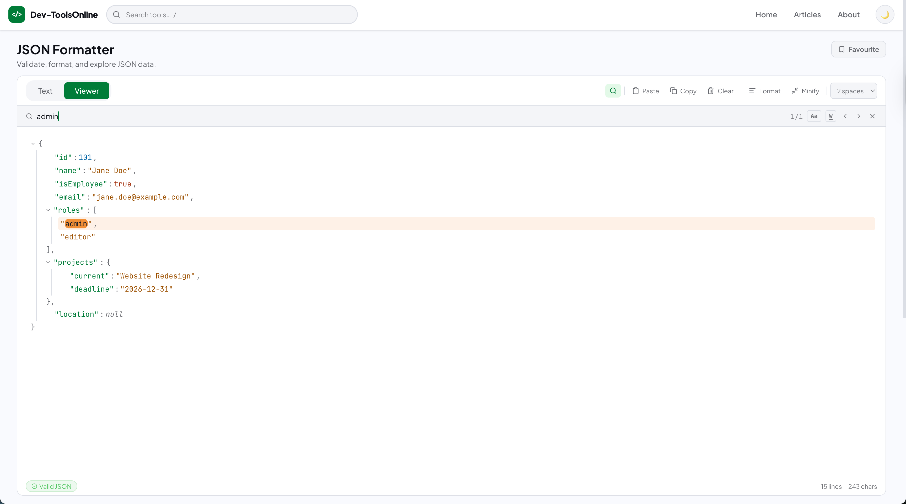
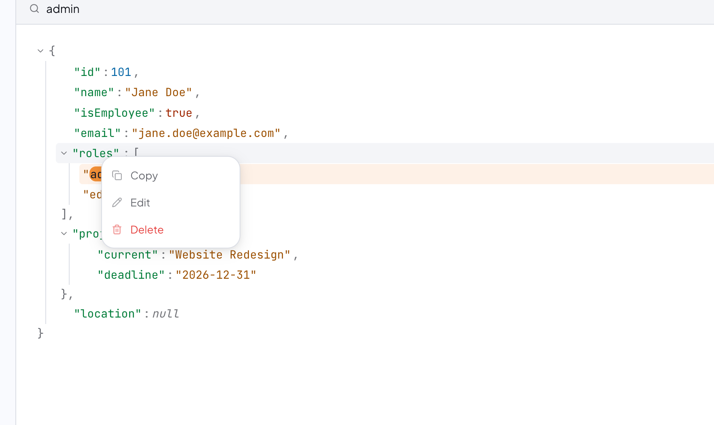
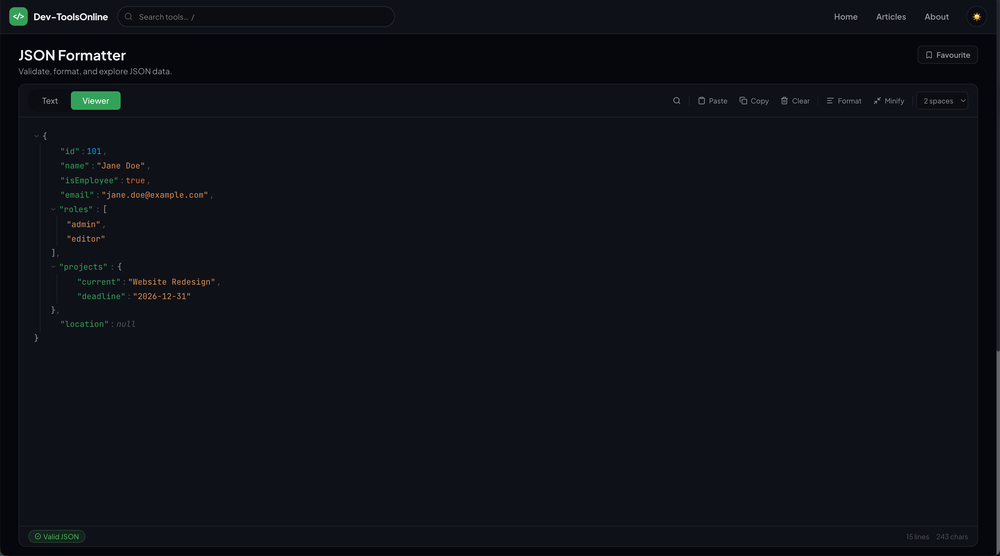

# JSON Formatter & Viewer

A simple, fast JSON formatter I built because most existing tools felt slow, cluttered, or missing small but important features.

👉 https://dev-toolsonline.com/tools/json-formatter

---

## About

This tool is part of a small project called Dev Tools Online — a collection of useful utilities I’m building for everyday developer tasks.

The goal is straightforward: open the page and get things done quickly. No login, no setup, no friction.

If you work with APIs, logs, or just messy JSON, this should save you time.

## Screenshots

### Clean and readable JSON view

Formatted JSON with clear structure and syntax highlighting, making it easy to scan and understand.

---

### Search inside large JSON

Quickly find keys and values without scrolling through large amounts of data.

---

### Copy specific objects

Copy only what you need — no more copying the entire JSON just to extract a small part.

---

### Dark mode

Comfortable to use during long sessions, especially when working at night.

---

## What’s different about it?

There are a lot of JSON formatters out there. Most of them do the basics, but they often miss the little things that actually matter when you’re working with real data.

This one focuses on usability and speed, with features that make debugging and exploring JSON much easier:

- Built to handle large JSON without freezing
- Clean UI that doesn’t get in your way
- Everything works instantly in the browser
- No data is stored or sent anywhere

But more importantly, it includes features I personally kept missing in other tools 👇

---

## Features

### 🔍 Search inside JSON
Quickly find keys or values, even in large files.

---

### 📋 Copy specific objects
You can copy individual parts of the JSON, not just the whole thing.

Super useful when you only need a nested object.

---

### 🛠 Auto-fix JSON
If your JSON is slightly broken, the tool tries to fix common issues automatically so you don’t have to.

---

### 📂 Upload JSON files
Drop a file and start working immediately.

---

### 🔗 Auto-paste from links
Paste a URL that with autopaste, and it loads directly into the viewer.

---

### 🌙 Dark mode
Easy on the eyes for long sessions.

---

### ✨ Core functionality
- Format / beautify JSON
- Minify JSON
- Validate structure
- Syntax highlighting
- One-click copy
- Works on desktop and mobile

---

## When is this useful?

- Debugging API responses
- Reading large JSON payloads
- Extracting specific data quickly
- Fixing invalid JSON
- Cleaning JSON before sharing

---

## About Dev Tools Online

This is just one tool in a growing collection.

I’m focusing on building small utilities that:
- load fast
- are easy to use
- don’t require accounts

More tools are on the way.
https://dev-toolsonline.com/

---

## Feedback

If something feels off or missing, let me know.

I’m actively improving this based on real usage.

---

## Support

If you find it useful, feel free to:
- Star the repo
- Share it
- Use it in your workflow
